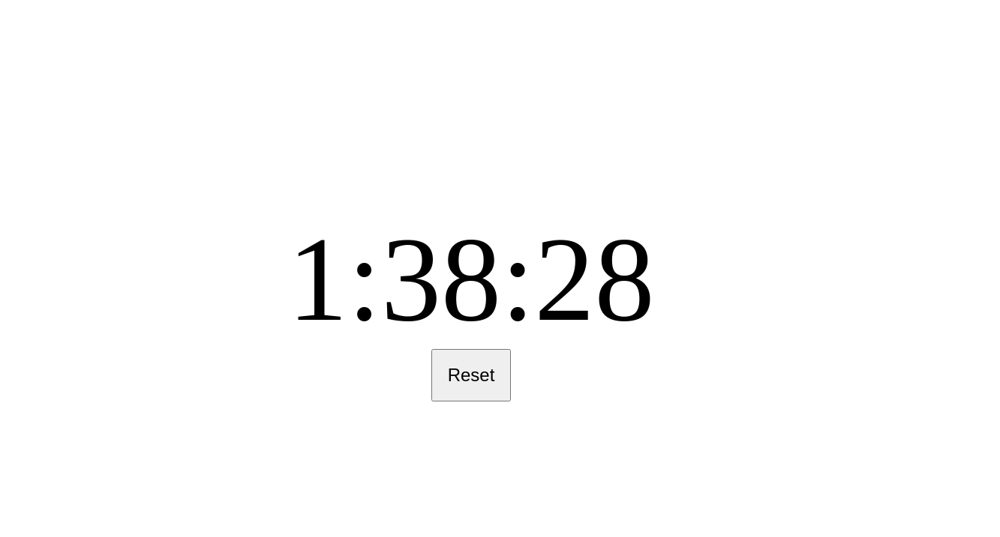

# Simple Counter

A simple counter in vanilla JavaScript.

[Live version](https://victorribeiro.com/eatingTime)

## About

I've been using this simple counter to keep track when it's time to take a break and [eat](https://victorribeiro.com/eatingTime) something, but the code is very easy to modify to other purposes.

## Motivation

Most of my days is to sit in front the computer with an IDE and a browser opened. So I wrote this code to help me remember when it's time to eat. I just leave a tab open; and even if I close the tab, the counter is stored in localStorage so it resumes when I open it back (this also could be stored in a database online, so you can keep track in other devices aswell).

